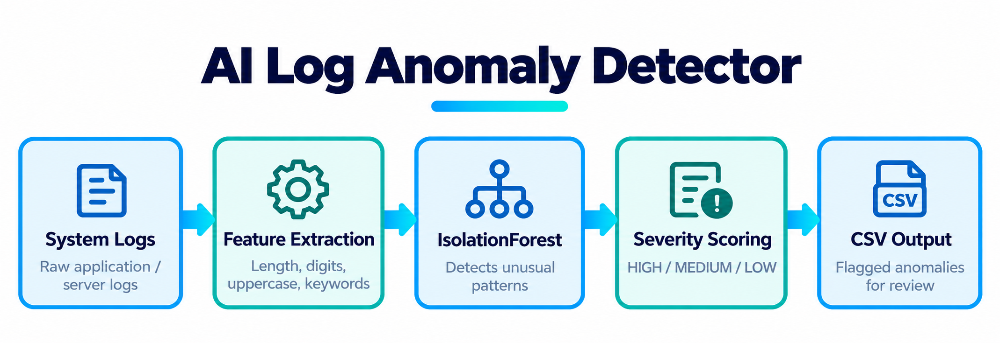

# AI Log Anomaly Detector

A lightweight Python machine learning project that analyzes system log entries and detects unusual activity using IsolationForest.

The project also assigns a severity level to detected anomalies so unusual events can be prioritized for review.



## Features

- Detects unusual log activity using IsolationForest
- Extracts numeric features from raw log entries
- Assigns HIGH, MEDIUM, or LOW severity levels
- Generates an anomaly score for each detected event
- Saves detected anomalies to a CSV file
- Uses a small, easy-to-understand Python codebase

## Technologies

- Python
- NumPy
- scikit-learn
- IsolationForest
- CSV

## How It Works

The project uses two separate steps.

### 1. Anomaly Detection

Each log entry is converted into numeric features such as:

- Log entry length
- Ratio of numbers
- Ratio of uppercase characters
- Number of alert-related keywords
- Number of structured fields
- Number of URL or file path characters

IsolationForest analyzes these features and identifies log entries whose patterns differ from the majority of the data.

### 2. Severity Scoring

After an anomaly is detected, a rule-based function assigns a severity level.

- HIGH: Error, failed, denied, unauthorized, or critical activity
- MEDIUM: Warning or timeout activity
- LOW: Other unusual activity

The machine learning model determines whether an event is unusual.

The severity logic determines how the detected event should be prioritized.

## Project Structure

```text
ai-log-anomaly-detector/
│
├── img/
│   ├── ai-log-anomaly-detection-pipeline.png
│   └── ai-log-anomaly-detector-vscode.png
├── detect.py
├── sample_logs.txt
├── requirements.txt
├── .gitignore
├── anomalies.csv
└── README.md
