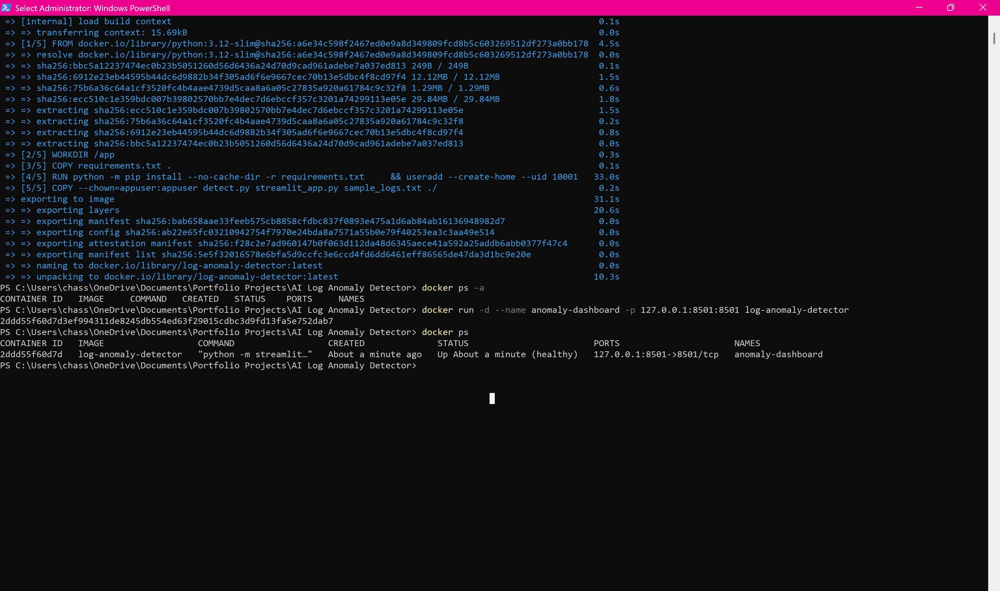
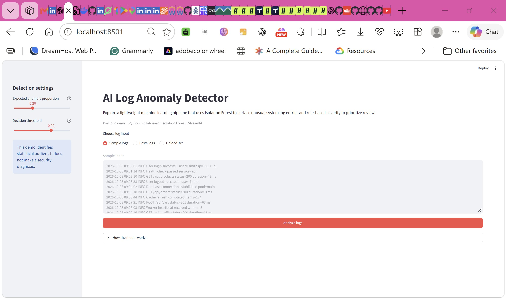
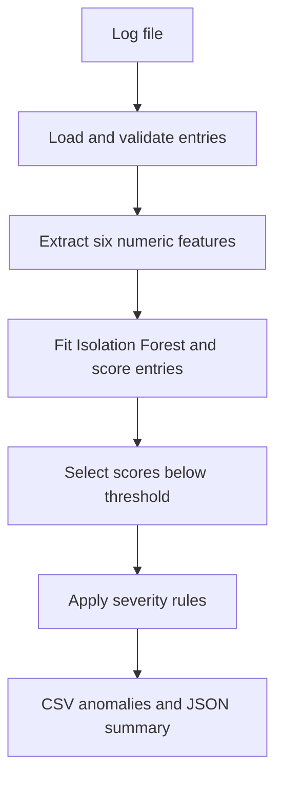

# AI Log Anomaly Detector

**[Live Demo](https://chass-ai-log-anomaly-detector.streamlit.app/)**

A Python machine learning pipeline that helps prioritize unusual system logs for investigation. It converts raw log entries into numeric features, uses **Isolation Forest** to detect outliers, then applies separate **rule-based severity classification** and exports reviewable CSV results plus a JSON run summary.

**Stack:** Python, NumPy, scikit-learn, Streamlit, pytest, GitHub Actions, Docker.

Built to explore a practical software operations problem: finding unusual activity in a stream of routine application events. The included sample contains API requests, login activity, health checks, and operational warnings. The project includes both a command-line pipeline and a recruiter-friendly Streamlit demo using synthetic data.

## Interactive demo

Run the web demo locally:

```bash
python -m pip install -r requirements.txt
streamlit run streamlit_app.py
```

The demo lets users analyze the included sample, paste logs, or upload a UTF-8 `.txt`/`.log` file. It displays run statistics and flagged entries, exposes the contamination and decision-threshold settings, and provides CSV and JSON downloads.

### Demo preview

[](https://chass-ai-log-anomaly-detector.streamlit.app/)

*Streamlit interface for analyzing system logs, detecting anomalies with Isolation Forest, and prioritizing flagged events by severity.*

**Live app:** https://chass-ai-log-anomaly-detector.streamlit.app/

The public demo is deployed on Streamlit Community Cloud from `streamlit_app.py` and updates from the `main` branch.

## Run with Docker

Docker packages the Python runtime, application dependencies, and synthetic sample
logs into one image. Install and start Docker Desktop (Linux containers on
Windows), then open a terminal in this repository.

Check that the Docker engine is available:

```bash
docker version
```

Build the image and start the dashboard:

```bash
docker build -t log-anomaly-detector .
docker run -d --name anomaly-dashboard -p 127.0.0.1:8501:8501 log-anomaly-detector
```

Open [http://localhost:8501](http://localhost:8501). Select **Sample logs**, click **Analyze logs**, and
verify that flagged events appear and the CSV and JSON downloads work.
The dashboard runs in the background; the named container is retained for reuse.

Inspect the running container:

```bash
docker ps
docker logs anomaly-dashboard
docker inspect --format='{{.State.Health.Status}}' anomaly-dashboard
```

The health status may start as `starting`; allow up to a minute for it to become
`healthy`. The health check verifies that the Streamlit server responds, not
the accuracy of anomaly detection.

You can also run the command-line detector in a temporary container:

```bash
docker run --rm log-anomaly-detector python detect.py --output /tmp/anomalies.csv --summary /tmp/summary.json
```

This prints detection statistics. These output files exist only inside that
temporary container and are removed when it exits; use the dashboard downloads
to save results to your computer.

The image runs as a non-root user, copies only required runtime files, disables
Streamlit usage telemetry, and binds the published port to your local computer.
It requires no AWS credentials. Docker support does not change the public
Streamlit Community Cloud deployment.

GitHub Actions builds the image, runs the sample CLI pipeline, and checks dashboard
readiness in the **Docker smoke test** workflow.

Stop the dashboard when finished, or restart the existing container later:

```bash
docker stop anomaly-dashboard
docker start anomaly-dashboard
```

Run `docker start` to reuse an existing container instead of repeating `docker run`
with the same name.

### Local Docker verification

Verified locally on Windows with Docker Desktop: built the image, started the
dashboard container, confirmed its `healthy` status, analyzed sample logs in the
browser, and downloaded CSV results.



*Successful image build and running container with port 8501 published to localhost.*



*Local dashboard at localhost:8501 after analyzing sample logs.*

## Quick start

Use Python 3.11 or 3.12. From the repository directory:

```bash
python -m venv .venv
```

Activate the environment:

```bash
# Windows PowerShell
.venv\Scripts\Activate.ps1

# macOS or Linux
source .venv/bin/activate
```

Install and run:

```bash
python -m pip install -r requirements.txt
python detect.py
```

Default outputs are `anomalies.csv` and `summary.json`.

```bash
python detect.py --input sample_logs.txt --output results.csv --summary run.json --contamination 0.10
python detect.py --contamination auto --threshold -0.02
python detect.py --help
```

Input must be UTF-8 text with at least five non-empty entries, one per line. Blank lines are skipped. Output directories must already exist. Input, CSV, and summary paths must differ. Invalid settings, missing files, and insufficient input return a nonzero exit status.

## Pipeline



### Features and severity

Each entry becomes six features: length, digit ratio, uppercase ratio, alert-keyword occurrence count, equals-sign count, and slash count. The keyword feature counts substring occurrences; overlapping terms such as `WARN` and `WARNING` can both contribute. Equals signs and slashes are simple proxies for structured fields and paths, rather than a full log parser.

The model identifies unusual feature patterns. Only selected anomalies receive a severity:

| Severity | Case-insensitive keyword rules |
|---|---|
| HIGH | ERROR, FAILED, DENIED, UNAUTHORIZED, CRITICAL |
| MEDIUM | WARNING, WARN, TIMEOUT, if no HIGH keyword matches |
| LOW | No severity keyword matches |

Severity is a rule-based review priority, not a learned prediction or a security verdict.

## Example results

With the included 20-entry sample, default settings, Python 3.12, and scikit-learn 1.8.0:

| Run statistic | Result |
|---|---:|
| Logs analyzed | 20 |
| Anomalies detected | 4 |
| Anomaly percentage | 20% |
| HIGH / MEDIUM / LOW | 2 / 2 / 0 |
| Selected decision-score range | -0.0726 to -0.0173 |

See [example CSV](anomalies.csv) and [example JSON summary](examples/summary.json). The summary also records contamination, decision threshold, and random seed. Scores in exported results are rounded to four decimals; selection uses full-precision values.

These are run statistics, not accuracy measurements. The sample has no independently validated labels. For example, the database failure entry is not selected at the default cutoff, illustrating that unusualness and importance are different. Results may change across library versions.

## Engineering decisions

- **Isolation Forest:** useful for an unsupervised baseline when labeled incidents are unavailable. It isolates unusual numeric patterns without needing a classifier trained on incident labels.
- **Explicit feature extraction:** keeps the prototype small and makes the inputs inspectable. It does not understand log semantics, event sequences, or numeric field values such as latency.
- **Configurable contamination:** `0.20` preserves the original demonstration setting. Numeric values must be in `(0, 0.5]`; `auto` uses the model's automatic offset. This is a cutoff assumption, not measured incident prevalence. Real workloads require tuning.
- **Configurable decision threshold:** flag entries with `decision_function < threshold`. The default is zero; lower values select fewer entries. These scores are not probabilities. Changing contamination also changes the decision-score offset.
- **Repeatable runs:** 200 trees and `random_state=42` make runs repeatable with the same input and environment.
- **Separate severity logic:** keeps ML unusualness distinct from keyword-based business priority.
- **CSV and JSON:** support manual review and downstream scripts without adding a service deployment.

The batch is used both to fit the model and detect outliers. This is not held-out evaluation or a model trained on a separate normal baseline. The five-entry minimum is an input guard, not evidence of sufficient training data. Duplicate patterns, dataset composition, and substring matches can cause missed incidents or false alarms.

A future evaluation would use independently labeled logs, a separate training baseline and validation set, and precision/recall measurements with thresholds selected on validation data. This project currently makes no production reliability or accuracy claim.

## Tests and CI

```bash
python -m pip install -r requirements-dev.txt
python -m pytest -q
```

Tests cover feature values, empty features, severity priority, Unicode and blank input handling, invalid data and settings, reproducibility, threshold selection, CSV escaping, summary consistency, CLI output, and failure exit codes. GitHub Actions runs tests and the sample pipeline on Python 3.11 and 3.12 for pushes and pull requests.

## Security

- **CodeQL** scans Python changes for security issues on pushes and pull requests to `main`, plus a weekly scheduled scan.
- **Dependabot** checks Python packages and GitHub Actions weekly and opens dependency update pull requests.
- The Streamlit demo accepts text-only `.txt` and `.log` uploads, limits uploads to 1 MB and 5,000 entries, and does not execute uploaded content.
- Use synthetic or non-sensitive logs in the public demo. Do not upload credentials, tokens, personal data, production logs, or confidential information.
- See [SECURITY.md](SECURITY.md) for responsible vulnerability reporting.

## Files

| Path | Purpose |
|---|---|
| `detect.py` | Feature extraction, detection, severity, export, and CLI |
| `streamlit_app.py` | Interactive portfolio demo for sample, pasted, or uploaded logs |
| `sample_logs.txt` | Synthetic demonstration input |
| `anomalies.csv` | Example detected events |
| `examples/summary.json` | Example run statistics |
| `tests/test_detect.py` | Automated detector and CLI tests |
| `tests/test_streamlit_demo.py` | Demo input and CSV helper tests |
| `.github/workflows/tests.yml` | CI test matrix, demo validation, and sample smoke run |
| `Dockerfile` | Non-root container image for the dashboard and CLI |
| `.dockerignore` | Restricts the Docker build context to runtime files |
| `.github/workflows/docker.yml` | Container build, CLI smoke run, and dashboard health check |
| `requirements.txt` | Runtime dependencies |
| `requirements-dev.txt` | Runtime dependencies plus pytest |
| `img/` | Project architecture and demo visuals |

## References

- [scikit-learn Isolation Forest documentation](https://scikit-learn.org/stable/modules/generated/sklearn.ensemble.IsolationForest.html)
- [scikit-learn outlier detection guide](https://scikit-learn.org/stable/modules/outlier_detection.html)
